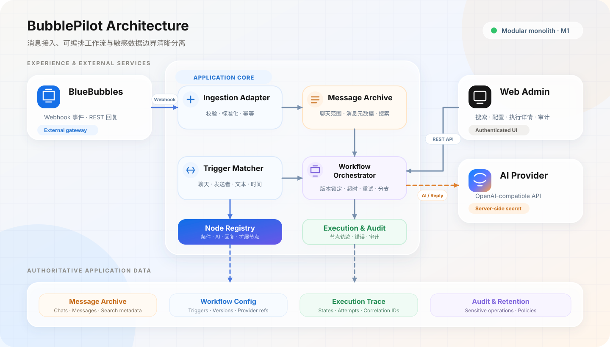
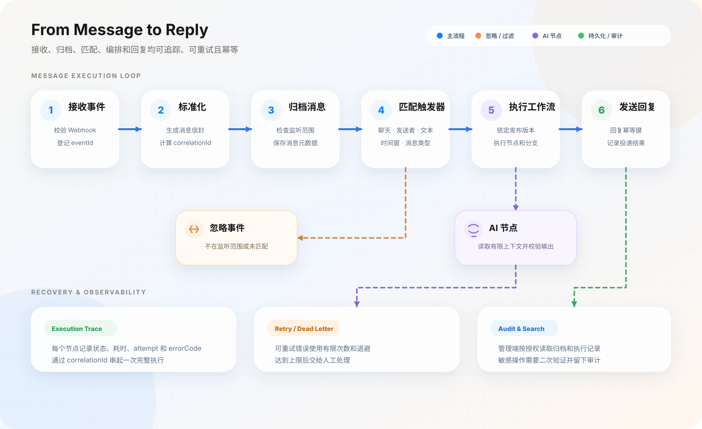
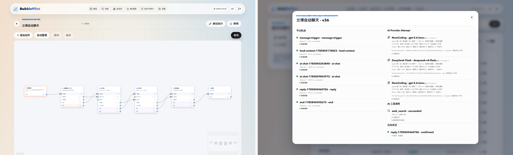

<p align="center">
  
</p>

<h1 align="center">BubblePilot</h1>

<p align="center">
  <a href="README.en.md">English</a> ·
  <strong>简体中文</strong> ·
  <a href="README.zh-TW.md">繁體中文</a>
</p>

<p align="center">
  <strong>让 BlueBubbles 对话自动运转。</strong>
</p>

<p align="center">
  自托管的 BlueBubbles 消息归档、工作流自动化与 AI Bot 平台。
</p>

<p align="center">
  <a href="#10-分钟完成首次配置">快速部署</a> ·
  <a href="doc/部署与运维.md">部署与运维</a> ·
  <a href="doc/README.md">文档中心</a>
</p>

<p align="center">
  <a href="https://github.com/shigella520/BubblePilot/actions/workflows/ci.yml"></a>
  <a href="LICENSE"></a>
  <a href="https://www.docker.com/"></a>
  <a href="https://www.postgresql.org/"></a>
</p>

<p align="center">
  <a href="https://linux.do" target="_blank">
    
  </a>
</p>

BubblePilot 接收 BlueBubbles 的新消息，在你指定的聊天中保存内容、匹配触发条件并执行可视化工作流。工作流可以读取最近对话、调用一个或多个 OpenAI 兼容服务、按需联网搜索，再把结果安全地回复到原聊天。

- **只处理你选择的聊天**：未启用监听的聊天只保留发现所需的最小元数据，不归档正文。
- **自动化过程可解释**：入站、匹配、节点、AI 调用、搜索工具和回复状态都能在管理端追踪。
- **AI 服务不被单点绑定**：多个 Provider 可按固定顺序 Retry、Fallback，并在连续故障后自动降级。
- **数据保存在自己的实例**：PostgreSQL 是消息、配置、执行和审计记录的权威来源。

## 你可以用它做什么

| 场景 | BubblePilot 提供的能力 |
| --- | --- |
| 保存重要对话 | 按聊天开启监听，搜索归档消息，并按授权范围导出 JSON Lines |
| 创建群聊 Bot | 用聊天、发送者、消息类型、关键词、前缀、正则和时间窗口触发工作流 |
| 编排消息流程 | 在画布中连接上下文、条件、变量、AI、回复和结束节点 |
| 接入不同 AI | 管理多个 OpenAI 兼容 Provider、模型和路由，自动 Retry、Fallback 与恢复 |
| 获取最新网页信息 | 由模型按需使用 Provider 托管搜索，或通过 Function Calling 调用自托管 SearXNG |
| 排查失败 | 查看执行、节点、Provider Attempt、工具轨迹和出站状态，安全恢复死信 |

联网搜索不是必需功能。关闭时 BubblePilot 仍可完成消息归档、普通工作流和不联网的 AI 回复。

## 如何工作



BlueBubbles 只负责收发 iMessage；BubblePilot 保存自己的监听配置、归档、工作流、执行和审计事实。消息进入后会先标准化和去重，再判断监听范围、匹配触发器并锁定工作流版本，因此 Webhook 重投不会产生重复回复。



## 实际使用效果

左侧展示可视化工作流编排，右侧展示节点、AI Provider、联网搜索和出站回复的完整执行轨迹。点击图片可查看原始清晰度。

[](assets/preview/bubblepilot-usage.png)

## 10 分钟完成首次配置

BubblePilot 的可用条件多于“容器已经启动”。请按下面的顺序完成 BlueBubbles、Webhook、聊天监听、AI 路由和工作流配置。

### 前置条件

- 一台已正常收发 iMessage 的 [BlueBubbles Server](https://bluebubbles.app/)；你需要知道它的 Server URL 和 REST API Password。
- 安装了 Git、Docker Engine 和 Docker Compose v2 的 Linux 主机、NAS 或服务器。
- BlueBubbles Server 能访问 BubblePilot 的 Webhook 地址。公网部署应使用 HTTPS；同一受控私网内也可以使用私有地址。
- 如需 AI 工作流，准备一个 OpenAI 兼容接口的 Base URL、模型名和 API Key。

### 推荐：提供服务器信息，让 Codex 协助部署

BubblePilot 涉及两套管理密码、多个独立 Secret、BlueBubbles Webhook、反向代理、聊天监听和可选 AI 路由。配置遗漏会导致“容器健康但无法使用”，因此建议使用 Codex App 或 Codex CLI 辅助部署，并先让 Codex 检查计划和缺失信息再执行。

在 Codex 中打开本仓库，或连接已经配置好 SSH Key 的服务器项目，然后复制下面的模板并替换虚构信息：

```text
请帮我把 BubblePilot 部署到下面的服务器。先阅读 AGENTS.md、README.md、
doc/部署与运维.md 和 .env.example，先给出计划并检查缺失信息，确认后再执行。

服务器信息：
- 操作系统：Ubuntu 24.04 amd64
- SSH：deploy@bubblepilot.example.com:22（SSH Key 已在本机配置）
- 部署目录：/opt/bubblepilot
- 对外域名：https://bubblepilot.example.com
- 反向代理：Caddy，已安装；如未安装请先告诉我
- Docker：已安装 Docker Engine 和 Docker Compose v2
- 部署方式：从当前仓库源码构建

BlueBubbles：
- Server URL：http://192.0.2.10:1234
- REST API Password：需要时暂停，让我在受控终端输入
- BubblePilot Webhook 可从 BlueBubbles Server 访问
- 初始 Chat GUID：暂时未知，先通过第一条 Webhook 发现

应用偏好：
- 消息正文保留：90 天
- 联网搜索：启用
- AI Provider：OpenAI 兼容 Responses API
- AI Base URL：https://api.example.com/v1
- 模型：example-model
- API Key：需要时暂停，让我在受控终端输入

执行要求：
1. 先检查系统、端口、DNS、HTTPS、Docker 和目录权限；发现阻塞项先停止并说明。
2. 生成彼此独立的数据库密码、API Token、设置加密密钥、Webhook Secret
   和 SearXNG Secret，直接写入权限受限的 .env，不在回复或普通日志中打印。
3. 登录密码和敏感操作密码必须不同；需要明文时暂停，让我在受控终端输入，
   只把 scrypt 哈希写入 .env。
4. 不要要求我把 SSH 私钥、密码、Token 或 API Key 粘贴到对话中。
5. 配置反向代理 HTTPS，禁止记录 BlueBubbles Webhook 查询串；不要公开
   PostgreSQL 或 SearXNG。
6. 执行 docker compose config、启动服务、检查容器和 /health/ready。
7. 验证 BlueBubbles REST 连接，给出需要填入 BlueBubbles 的 Webhook URL。
8. 未经我确认，不要启用任意聊天监听、生产工作流或执行数据删除。
9. 完成后列出已完成项、仍需我在 Web 页面完成的步骤、验证结果和回滚方式。

完成条件：BubblePilot 经 HTTPS 可登录，所有容器健康，BlueBubbles REST
连接成功，Webhook URL 已生成，Secret 未出现在输出中；聊天监听、AI 路由和
第一条工作流由我确认后再启用。
```

示例中的地址和账号都是虚构值。Codex 可以完成环境检查、生成配置、启动、健康验证和反向代理配置，但涉及真实凭据、BlueBubbles 管理页面以及启用生产监听或工作流时，仍应由你确认。若不使用 Codex，请继续按下面的手动步骤部署。

### 1. 获取项目

```bash
git clone https://github.com/shigella520/BubblePilot.git
cd BubblePilot
cp .env.example .env
```

### 2. 生成 Secret 和两套密码哈希

先为以下配置分别生成随机值：

```bash
for key in POSTGRES_PASSWORD API_ACCESS_TOKEN SETTINGS_ENCRYPTION_KEY BLUEBUBBLES_WEBHOOK_SECRET SEARXNG_SECRET; do
  printf '%s=' "$key"
  openssl rand -hex 32
done
```

登录密码和敏感操作密码是两套独立控制，不能相同。下面的命令只通过标准输入读取密码；运行两次，并把每次最后输出的 `scrypt$...` 分别保存：

```bash
printf '输入密码（输入不会显示）：' >&2
IFS= read -r -s BUBBLEPILOT_PLAIN_PASSWORD
printf '\n' >&2
printf '%s' "$BUBBLEPILOT_PLAIN_PASSWORD" | \
  docker compose run --rm --no-deps --build --entrypoint node app dist/app/hash-password.js
unset BUBBLEPILOT_PLAIN_PASSWORD
```

### 3. 完成 `.env`

至少替换下面这些值；所有 `CHANGE_ME` 都必须处理：

| 配置 | 填写内容 |
| --- | --- |
| `POSTGRES_PASSWORD` | 上一步生成的数据库密码 |
| `DATABASE_URL` | 把连接串中的数据库密码改成与 `POSTGRES_PASSWORD` 相同 |
| `API_ACCESS_TOKEN` | 独立随机值，用于管理 API 兼容访问 |
| `SETTINGS_ENCRYPTION_KEY` | 独立随机值；用于加密数据库中的运行时凭据，部署后必须稳定保存 |
| `BLUEBUBBLES_WEBHOOK_SECRET` | 独立随机值；稍后放入 Webhook URL |
| `BLUEBUBBLES_SERVER_URL` | BlueBubbles Server 根地址，例如 `http://192.0.2.10:1234` |
| `BLUEBUBBLES_ACCESS_TOKEN` | BlueBubbles Server 的 REST API Password |
| `APP_LOGIN_PASSWORD_HASH` | 第一次生成的哈希，必须用单引号包裹 |
| `SENSITIVE_OPERATION_PASSWORD_HASH` | 第二次生成的不同哈希，必须用单引号包裹 |
| `SEARXNG_SECRET` | 独立随机值，即使暂不联网搜索也需要设置 |

哈希包含 `$`，必须保留单引号：

```dotenv
APP_LOGIN_PASSWORD_HASH='scrypt$...'
SENSITIVE_OPERATION_PASSWORD_HASH='scrypt$...'
```

可选配置：

- `MONITORED_CHAT_IDS`：已知 Chat GUID 时可提前写入，多个值以逗号分隔；留空时先通过 Webhook 发现聊天，再在管理端开启监听。
- `MESSAGE_RETENTION_DAYS`：消息正文和附件元数据默认保留 90 天；设为 `0` 表示明确接受无限期保留风险。
- `ENABLE_WEB_SEARCH`：默认 `false`。需要 SearXNG 联网搜索时改为 `true`。
- `BUBBLEPILOT_IMAGE`：源码部署会由 Compose 本地构建；正式部署可固定为 `ghcr.io/shigella520/bubblepilot:1.0.0`，不要长期使用 `dev` 或 `latest`。

### 4. 启动并检查服务

```bash
docker compose config
docker compose up -d --build
docker compose ps
curl --fail http://127.0.0.1:8080/health/ready
```

默认只有 BubblePilot Web 映射到宿主机 `127.0.0.1:8080`；PostgreSQL 和 SearXNG 不对宿主机开放。先通过 Nginx、Caddy 或受控隧道配置 HTTPS，再对外提供管理页面和 Webhook。

访问 `http://127.0.0.1:8080`（或你的 HTTPS 域名），使用原始登录密码登录。查看消息正文、修改监听和系统设置时，页面会要求输入另一套敏感操作密码。

### 5. 连接 BlueBubbles

1. 在 BubblePilot 的“设置”页面完成二次验证，确认 Server URL、Access Token 和发送方式，然后点击“验证服务连接”。
2. 在 BlueBubbles Server 中新增 Webhook，订阅 `New Messages`。
3. Webhook URL 填写：

```text
https://bubblepilot.example.com/api/v1/webhooks/bluebubbles?token=<BLUEBUBBLES_WEBHOOK_SECRET>
```

4. 从另一账号向一个测试聊天发送消息。若未提前填写 `MONITORED_CHAT_IDS`，第一条消息只用于发现聊天，不保存正文。
5. 回到 BubblePilot 的“消息”页面，完成二次验证并开启该聊天的监听，再发送第二条测试消息。

反向代理必须关闭该 Webhook 路径的查询串访问日志，避免 Secret 落入日志。更完整的网络和 BlueBubbles 设置见[部署与运维](doc/部署与运维.md#连接-bluebubbles)。

### 6. 配置 AI Provider（可选）

1. 进入“AI Provider”，创建 Provider，填写接口类型、Base URL、模型、API Key 和超时。
2. 按 Provider 实际能力勾选 Function Calling 或托管搜索，再运行连接与能力测试。
3. 创建一条 Provider 路由，选择候选顺序以及 Fallback、Retry、降级阈值和冷却时间。
4. 若要联网搜索，确认 `.env` 中 `ENABLE_WEB_SEARCH=true`，且页面显示搜索后端可用。

API Key 会使用 `SETTINGS_ENCRYPTION_KEY` 加密保存到 PostgreSQL，之后不会在页面、接口或日志中回显。

### 7. 创建第一条工作流

进入“工作流”并新建画布。最小 AI 回复流程可以这样连接：

```text
消息触发器 → 加载聊天上下文 → AI 对话 → 回复消息 → 结束
```

1. 在“消息触发器”中选择已监听聊天，填写关键词或前缀，并打开节点的启用开关。
2. 在“AI 对话”中选择刚创建的 Provider 路由，设置提示词、输出上限和联网策略。
3. “回复消息”默认可以使用 `{{variables.aiReply}}` 发送 AI 节点结果。
4. 连接节点的成功出口，保存工作流，再点击顶部“启用”。
5. 在目标聊天发送符合条件的消息，到“执行”页面检查每个节点和最终回复状态。

不需要 AI 时，可以使用“消息触发器 → 回复消息 → 结束”创建固定回复自动化。

## 上线前检查

- BubblePilot 与 BlueBubbles 的外部访问都使用 HTTPS 或受控私网。
- 反向代理不记录 Webhook 查询串，PostgreSQL 和 SearXNG 未暴露到公网。
- `.env` 和备份位于受控存储；`SETTINGS_ENCRYPTION_KEY` 不会在升级时变化。
- 已确认消息保留期、监听范围和 AI 上下文范围。
- 已完成数据库备份，并使用精确镜像标签执行升级。

备份、恢复、升级、回滚和故障诊断命令见[部署与运维](doc/部署与运维.md)。

## 文档

| 文档 | 适合什么时候阅读 |
| --- | --- |
| [文档中心](doc/README.md) | 查看全部文档及其权威范围 |
| [产品与范围](doc/产品与范围.md) | 了解目标用户、已完成范围、验收和后续方向 |
| [部署与运维](doc/部署与运维.md) | 首次配置、生产部署、备份、升级和排障 |
| [技术设计](doc/技术设计.md) | 了解架构、数据边界、安全和模块职责 |
| [事件与工作流设计](doc/事件与工作流设计.md) | 了解触发、节点、AI 路由、幂等和恢复语义 |
| [接口与配置契约](doc/接口与配置契约.md) | 查询 API、权限、环境变量和机器契约 |
| [开发与发布](doc/开发与发布.md) | 本地开发、验证、迁移、分支和发布流程 |

## 许可证

BubblePilot 使用 [MIT License](LICENSE) 开源。
