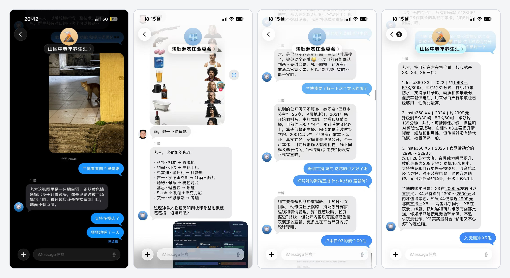

<p align="center">
  
</p>

<h1 align="center">BubblePilot</h1>

<p align="center">
  <a href="README.en.md">English</a> ·
  <a href="README.md">简体中文</a> ·
  <strong>繁體中文</strong>
</p>

<p align="center">
  <strong>讓 BlueBubbles 對話自動運轉。</strong>
</p>

<p align="center">
  自託管的 BlueBubbles 訊息歸檔、工作流程自動化與 AI Bot 平台。
</p>

<p align="center">
  <a href="#10-分鐘完成首次設定">快速部署</a> ·
  <a href="doc/部署与运维.md">部署與維運</a> ·
  <a href="doc/README.md">文件中心</a>
</p>

<p align="center">
  <a href="https://github.com/shigella520/BubblePilot/actions/workflows/ci.yml"></a>
  <a href="LICENSE"></a>
  <a href="https://nodejs.org/"></a>
  <a href="https://www.typescriptlang.org/"></a>
  <a href="https://fastify.dev/"></a>
  <a href="https://vuejs.org/"></a>
  <a href="https://vite.dev/"></a>
  <a href="https://www.docker.com/"></a>
  <a href="https://www.postgresql.org/"></a>
</p>

BubblePilot 接收 BlueBubbles 的新訊息，只在你指定的聊天中保存內容、比對觸發條件並執行視覺化工作流程。工作流程可以讀取最近對話和圖片、呼叫一個或多個 OpenAI 相容服務、按需搜尋網頁，再把結果安全地回覆到原聊天。

- **只處理你選擇的聊天**：未啟用監聽的聊天只保留發現所需的最小中繼資料，不歸檔正文。
- **自動化過程可解釋**：入站、比對、節點、AI 呼叫、搜尋工具和回覆狀態都能在管理端追蹤。
- **AI 服務不被單點綁定**：多個 Provider 可按固定順序 Retry、Fallback，並在連續故障後自動降級。
- **群聊成員可以被準確識別**：依聊天為歷史 sender ID 設定本名和暱稱，AI 只讀取目前上下文實際出現成員的映射。
- **連結卡片也能成為 AI 上下文**：優先解析 BlueBubbles 中繼資料，必要時安全讀取公開 Open Graph，並保存有限診斷。
- **圖片可由原生多模態模型理解**：在全域安全限制內暫時讀取目前附件、卡片主圖和有限歷史圖片，失敗時明確降級為文字。
- **資料保存在自己的實例**：PostgreSQL 是訊息、設定、執行和稽核記錄的權威來源。

## 核心能力

| 場景             | BubblePilot 提供的能力                                                    |
| ---------------- | ------------------------------------------------------------------------- |
| 保存重要對話     | 按聊天啟用監聽、搜尋歸檔訊息，並在授權後匯出 JSON Lines                   |
| 建立群聊 Bot     | 使用聊天、傳送者、訊息類型、關鍵字、前綴、正規表示式和時間窗口觸發        |
| 識別群聊成員     | 從聊天歷史發現 sender ID，依聊天維護本名與暱稱，讓 AI 分辨每句話的發言者  |
| 理解連結卡片     | 歸檔標題、摘要和網站名稱，讓 AI 使用卡片上下文但不宣稱已閱讀完整網頁      |
| 理解聊天圖片     | 將目前圖片附件、連結卡片主圖和有限歷史圖片送入已驗證的原生多模態 Provider |
| 編排訊息流程     | 在畫布中連接上下文、條件、變數、AI、回覆和結束節點                        |
| 接入不同 AI      | 管理 OpenAI 相容 Provider 和路由，自動 Retry、Fallback 與恢復             |
| 取得最新網頁資訊 | 使用 Provider 託管搜尋，或透過 Function Calling 呼叫自託管 SearXNG        |
| 排查失敗         | 查看執行、節點、Provider Attempt、工具軌跡和出站狀態                      |

聯網搜尋是可選功能。關閉後仍可使用訊息歸檔、一般工作流程和不聯網的 AI 回覆。

## 如何運作


BlueBubbles 只負責收發 iMessage；BubblePilot 保存自己的監聽設定、歸檔、工作流程、執行和稽核事實。訊息會先標準化和去重，再進行比對，因此 Webhook 重投不會產生重複回覆。


## 實際使用效果

左側展示視覺化工作流程編排，右側展示節點、AI Provider、聯網搜尋和出站回覆的完整執行軌跡。點擊圖片可查看原始清晰度。

[](assets/preview/bubblepilot-usage.png)

啟用原生圖片輸入後，AI Bot 可以直接理解 iMessage 圖片附件和連結卡片主圖。圖片只在目前 AI 節點執行期間安全讀取並傳送給已驗證的多模態 Provider；取得或視覺呼叫失敗時會明確降級為文字，不中斷整個工作流程。

<p align="center">
  <a href="assets/preview/bubblepilot-multimodal-chat.jpg"></a>
</p>

## 10 分鐘完成首次設定

容器啟動只是第一步。請依序完成 BlueBubbles、Webhook、聊天監聽、AI 路由和工作流程設定。

### 前置條件

- 一台可正常收發 iMessage 的 [BlueBubbles Server](https://bluebubbles.app/)，以及它的 Server URL 和 REST API Password。
- 安裝 Git、Docker Engine 和 Docker Compose v2 的 Linux 主機、NAS 或伺服器。
- BlueBubbles Server 能連線到 BubblePilot 的 Webhook；公網部署應使用 HTTPS，或使用受控私有網路。
- 若要使用 AI 工作流程，準備 OpenAI 相容介面的 Base URL、模型名稱和 API Key。

### 建議：提供伺服器資訊，讓 Codex 協助部署

BubblePilot 涉及兩組管理密碼、多個獨立 Secret、BlueBubbles Webhook、反向代理、聊天監聽和可選 AI 路由。容器健康不代表產品已可使用，因此建議使用 Codex App 或 Codex CLI 先規劃、設定並驗證部署。

在 Codex 中開啟本倉庫，或連接已設定 SSH Key 的伺服器專案，再調整以下範例：

```text
請把 BubblePilot 部署到以下伺服器。先閱讀 AGENTS.md、README.md、
doc/部署與運維.md 和 .env.example，列出計畫和缺少資訊，確認後再執行。

伺服器：
- 系統：Ubuntu 24.04 amd64
- SSH：deploy@bubblepilot.example.com:22（SSH Key 已設定）
- 部署目錄：/opt/bubblepilot
- 公開網址：https://bubblepilot.example.com
- 反向代理：Caddy，已安裝
- Docker Engine 與 Docker Compose v2 已安裝
- 從目前倉庫原始碼建置

BlueBubbles：
- Server URL：http://192.0.2.10:1234
- 需要 REST API Password 時暫停，讓我在受控終端輸入
- 初始 Chat GUID 未知，先由第一條 Webhook 發現

偏好：
- 訊息正文保留 90 天
- 啟用聯網搜尋
- AI：OpenAI 相容 Responses API
- Base URL：https://api.example.com/v1
- 模型：example-model
- 需要 API Key 時暫停，讓我在受控終端輸入

要求：
1. 先檢查系統、連接埠、DNS、HTTPS、Docker 和目錄權限。
2. 分別產生隨機 Secret，直接寫入限制權限的 .env，不在回覆或日誌輸出。
3. 兩組管理密碼必須不同；只透過受控終端輸入，只保存 scrypt 雜湊。
4. 不要要求我把 SSH 私鑰、密碼、Token 或 API Key 貼到對話中。
5. 設定 HTTPS、關閉 Webhook 查詢字串日誌，不公開 PostgreSQL 或 SearXNG。
6. 驗證 Compose、啟動服務並檢查 /health/ready。
7. 測試 BlueBubbles REST，提供需要設定的 Webhook URL。
8. 未經確認，不啟用聊天監聽、生產工作流程或資料刪除。
9. 完成後列出已完成項目、剩餘 Web 步驟、驗證結果與回滾方式。

完成條件：HTTPS 可登入、全部容器健康、BlueBubbles REST 成功、Webhook URL
已產生且輸出沒有 Secret；等我確認後才啟用監聽、AI 路由和第一條工作流程。
```

以上地址和帳號均為虛構值。Codex 可以檢查環境、產生設定、啟動服務、驗證健康和設定反向代理；真實憑證以及任何啟用生產資料收集或自動化的動作仍需由你確認。不使用 Codex 時，請繼續下方手動步驟。

### 1. 取得專案

```bash
git clone https://github.com/shigella520/BubblePilot.git
cd BubblePilot
cp .env.example .env
```

### 2. 產生 Secret 和兩組密碼雜湊

```bash
for key in POSTGRES_PASSWORD API_ACCESS_TOKEN SETTINGS_ENCRYPTION_KEY BLUEBUBBLES_WEBHOOK_SECRET SEARXNG_SECRET; do
  printf '%s=' "$key"
  openssl rand -hex 32
done
```

登入密碼和敏感操作密碼必須不同。下面的命令只從標準輸入讀取密碼；執行兩次，分別保存最後輸出的 `scrypt$...`：

```bash
printf '輸入密碼（輸入不會顯示）：' >&2
IFS= read -r -s BUBBLEPILOT_PLAIN_PASSWORD
printf '\n' >&2
printf '%s' "$BUBBLEPILOT_PLAIN_PASSWORD" | \
  docker compose run --rm --no-deps --build --entrypoint node app dist/app/hash-password.js
unset BUBBLEPILOT_PLAIN_PASSWORD
```

### 3. 完成 `.env`

所有 `CHANGE_ME` 都必須替換：

| 設定                                | 填寫內容                                               |
| ----------------------------------- | ------------------------------------------------------ |
| `POSTGRES_PASSWORD`                 | 產生的資料庫密碼                                       |
| `DATABASE_URL`                      | 連線字串中的密碼必須與 `POSTGRES_PASSWORD` 相同        |
| `API_ACCESS_TOKEN`                  | 獨立的隨機管理 API 相容 Token                          |
| `SETTINGS_ENCRYPTION_KEY`           | 獨立且穩定的隨機值，用來加密 PostgreSQL 中的執行期憑證 |
| `BLUEBUBBLES_WEBHOOK_SECRET`        | 放入 Webhook URL 的獨立隨機值                          |
| `BLUEBUBBLES_SERVER_URL`            | BlueBubbles 根地址，例如 `http://192.0.2.10:1234`      |
| `BLUEBUBBLES_ACCESS_TOKEN`          | BlueBubbles REST API Password                          |
| `APP_LOGIN_PASSWORD_HASH`           | 第一組雜湊，必須用單引號包裹                           |
| `SENSITIVE_OPERATION_PASSWORD_HASH` | 第二組不同的雜湊，必須用單引號包裹                     |
| `SEARXNG_SECRET`                    | 獨立隨機值，即使暫不搜尋也需要設定                     |

```dotenv
APP_LOGIN_PASSWORD_HASH='scrypt$...'
SENSITIVE_OPERATION_PASSWORD_HASH='scrypt$...'
```

可選設定：

- `MONITORED_CHAT_IDS`：已知 Chat GUID 時可提前填入，多個值用逗號分隔；留空時先用 Webhook 發現聊天，再到管理端開啟監聽。
- `MESSAGE_RETENTION_DAYS`：正文與附件中繼資料預設保留 90 天；`0` 表示明確接受永久保留風險。
- `ENABLE_WEB_SEARCH`：預設 `false`，作為部署層級的安全總開關。開啟後，重試、逾時、結果數與失敗後備統一在 AI 頁面的「聯網搜尋全域設定」管理，儲存後立即生效。
- `BUBBLEPILOT_IMAGE`：原始碼部署由 Compose 本機建置；正式部署可固定為 `ghcr.io/shigella520/bubblepilot:1.2.0`，不要長期使用 `dev` 或 `latest`。

### 4. 啟動並檢查服務

```bash
docker compose config
docker compose up -d --build
docker compose ps
curl --fail http://127.0.0.1:8080/health/ready
```

預設只有 Web 應用映射到 `127.0.0.1:8080`；PostgreSQL 和 SearXNG 不對主機開放。對外提供服務前，請先設定 Nginx、Caddy 或受控隧道與 HTTPS。

用原始登入密碼進入管理頁。查看訊息、修改監聽和系統設定時，頁面會要求另一組敏感操作密碼。

### 5. 連接 BlueBubbles

1. 在 BubblePilot 的「設定」頁完成二次驗證，確認 Server URL、Access Token 和傳送方式，然後測試連線。
2. 在 BlueBubbles Server 新增 Webhook，訂閱 `New Messages`。
3. Webhook URL 填寫：

```text
https://bubblepilot.example.com/api/v1/webhooks/bluebubbles?token=<BLUEBUBBLES_WEBHOOK_SECRET>
```

4. 從另一帳號傳送測試訊息。若 `MONITORED_CHAT_IDS` 留空，第一條訊息只用來發現聊天，不保存正文。
5. 回到 BubblePilot 的「訊息」頁，完成二次驗證並開啟該聊天的監聽，再傳送第二條測試訊息。

反向代理必須關閉這條 Webhook 路徑的查詢字串存取日誌，避免 Secret 進入日誌。

### 6. 設定 AI Provider（可選）

1. 進入「AI Provider」，填寫介面類型、Base URL、模型、API Key 和逾時。
2. 只在 Provider 支援時開啟 Function Calling、託管搜尋或原生圖片輸入，再執行各項獨立能力測試。
3. 建立 Provider 路由，設定候選順序、Fallback、Retry、降級門檻和冷卻時間。
4. 若要搜尋，確認 `.env` 中 `ENABLE_WEB_SEARCH=true`，且頁面顯示搜尋後端可用。
5. 若要理解圖片，先確認 Provider 的圖片輸入能力已驗證，再於同一頁啟用全域原生圖片輸入；工作流程節點不需另行設定。

API Key 會使用 `SETTINGS_ENCRYPTION_KEY` 加密保存到 PostgreSQL，之後不會在頁面、介面或日誌中回顯。

### 7. 建立第一條工作流程

建立工作流程並連接最小 AI 回覆圖：

```text
訊息觸發器 → 載入聊天上下文 → AI 對話 → 回覆訊息 → 結束
```

1. 在「訊息觸發器」選擇已監聽聊天，設定關鍵字或前綴，並開啟節點的啟用開關。
2. 需要組合固定說明、目前事件與上游輸出時，加入「渲染文字」，並從範本編輯器插入允許的 Context 內容。
3. 在「AI 對話」選擇 Provider 路由，設定提示詞、輸出上限和聯網策略。
4. 將 `AI 對話.text` 連接到 `回覆訊息.text`，再連接控制流程。
5. 保存並啟用工作流程，在目標聊天傳送符合條件的訊息，再到「執行」頁檢查結果。

「渲染文字」支援 `{{context.event.message.text}}`、`{{context.event.message.senderId}}` 與 `{{context.outputs.<節點ID>.<輸出端口>}}` 等受控引用。

固定回覆只需使用「訊息觸發器 → 回覆訊息 → 結束」，不必設定 AI。

## 上線前檢查

- BubblePilot 與 BlueBubbles 的外部流量使用 HTTPS 或受控私網。
- 不公開 PostgreSQL 和 SearXNG，也不記錄 Webhook 查詢字串。
- 安全保存 `.env`、備份與 `SETTINGS_ENCRYPTION_KEY`，升級時不可意外變更加密金鑰。
- 已確認聊天監聽範圍、訊息保留期和 AI 上下文範圍。
- 升級前備份 PostgreSQL，正式環境使用精確映像標籤。

完整說明請參閱[部署與維運](doc/部署与运维.md)、[技術設計](doc/技术设计.md)、[事件與工作流程設計](doc/事件与工作流设计.md)和[介面與設定契約](doc/接口与配置契约.md)。

## 授權條款

BubblePilot 採用 [MIT License](LICENSE)。
