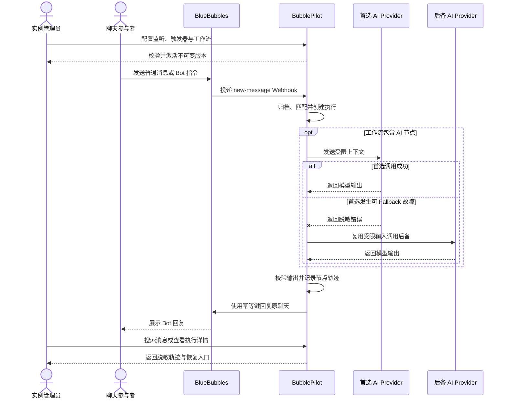

# BubblePilot 典型用户交互故事

## 1. 文档目的

本文从用户可观察的行为出发，补充说明 BubblePilot 在 M2-M5 阶段的典型交互和异常路径，用于辅助需求评审、界面设计、接口设计与验收测试。

本文不替代[目标需求](目标需求.md)、[事件与工作流设计](事件与工作流设计.md)和[安全与数据隐私](安全与数据隐私.md)。发生冲突时，以对应权威文档和机器契约为准；交互故事中新增的产品行为应先同步到权威文档，再进入实现。

## 2. 角色与交互边界

| 角色 | 目标 | 主要交互入口 |
| --- | --- | --- |
| 聊天参与者 | 在原聊天中发出普通消息或 Bot 指令，并收到符合预期的回复 | BlueBubbles 对话 |
| 实例管理员 | 管理监听范围、Provider、工作流和敏感数据访问 | BubblePilot Web 管理端 |
| 自动化维护者 | 定义触发器、验证工作流并查看执行结果 | BubblePilot Web 管理端 |
| 运维者 | 诊断失败、人工恢复、备份和升级实例 | Web 管理端、日志和部署命令 |

首期采用单实例管理员模型，实例管理员、自动化维护者和运维者可以是同一个人。BlueBubbles 和 AI Provider 是外部系统，不是 BubblePilot 的权限主体。

本文中的 Web 管理端描述目标体验，不要求 M2、M3 在 Web 界面完成之前就提供全部页面；早期里程碑可以通过受保护的管理 API 或受版本控制的配置实现等价行为。

## 3. 端到端交互概览

BubblePilot 的后段交互分为三个连续部分：

1. **配置面**：管理员启用聊天监听，配置 Provider，创建触发器和工作流草稿，校验后发布并激活。
2. **运行面**：聊天参与者发送消息，系统完成归档、匹配、版本锁定、节点执行、安全检查和幂等回复。
3. **运维面**：管理员搜索消息和执行轨迹，对失败执行进行人工重试或关闭，并从审计记录确认敏感操作。

## 4. 故事索引

| 编号 | 典型目标 | 主要里程碑 | 关联需求 |
| --- | --- | --- | --- |
| US-001 | 启用一个聊天的监听 | M4 | REQ-MSG-002、REQ-AUTH-002 |
| US-002 | 创建并激活一个 Bot 工作流 | M2、M4 | REQ-EVT-001、REQ-FLOW-001、REQ-AUTH-002 |
| US-003 | 在聊天中获得一次成功的 AI 回复 | M3 | REQ-FLOW-002、REQ-AI-001、REQ-AI-002、REQ-AI-003 |
| US-004 | 普通消息不被误触发 | M2 | REQ-MSG-002、REQ-EVT-001 |
| US-005 | 重复事件和 Bot 自身消息不产生重复回复 | M2 | REQ-MSG-003、REQ-FLOW-002 |
| US-006 | 从临时故障和死信中恢复 | M2、M3、M5 | REQ-FLOW-001、REQ-FLOW-002、REQ-AI-003 |
| US-007 | 搜索消息并追溯一次执行 | M4 | REQ-WEB-001、REQ-FLOW-002、REQ-AUTH-002 |
| US-008 | 更新或紧急停用工作流 | M2、M4 | REQ-FLOW-001、REQ-AUTH-002 |
| US-009 | 管理多个 AI Provider 与路由 | M3、M4 | REQ-AI-001、REQ-AI-003、REQ-AUTH-002 |
| US-010 | Provider Fallback、自动降级与恢复 | M3、M5 | REQ-FLOW-002、REQ-AI-003 |
| US-011 | 导出授权范围内的数据并留下审计 | M4、M5 | REQ-WEB-001、REQ-AUTH-002 |

## 5. 典型交互故事

### US-001：启用一个聊天的监听

**用户故事**：作为实例管理员，我希望只启用指定聊天的监听，以便保存和处理需要自动化的消息，同时避免收集无关对话。

**前置条件**：管理员已登录；BlueBubbles 接入可用；目标聊天可通过稳定 Chat GUID 识别。

**主流程**：

1. 管理员进入聊天监听配置，并完成敏感操作二次验证。
2. 管理员选择一个聊天，确认展示名称、类型和 Chat GUID 后启用监听。
3. BubblePilot 保存配置并写入审计记录。
4. 该聊天后续到达的新消息可以保存正文，并进入触发匹配。

**异常与边界**：

- 二次验证失败或过期时，不修改监听范围，并记录失败结果。
- 默认不自动导入启用前的历史消息；未来若支持回填，应作为独立、可审计的操作。
- 停用监听后，新消息不保存正文，也不触发工作流；既有归档按保留策略继续保存。

**验收重点**：未启用聊天的正文不可通过搜索或 ID 枚举读取；监听范围的每次变更都能定位到操作者、时间和结果。

### US-002：创建并激活一个 Bot 工作流

**用户故事**：作为自动化维护者，我希望把“指定群聊中以 `/sum` 开头的文本消息”绑定到摘要工作流，以便不修改代码就能上线一个 Bot 指令。

**前置条件**：目标聊天已启用监听；所需节点类型已注册；AI 工作流所引用的 Provider 路由有效且至少包含一个已启用候选。

**主流程**：

1. 维护者创建触发器草稿，选择聊天、发送者、消息类型以及关键词、前缀或正则条件。
2. 系统以可读形式展示条件组合，并允许使用虚构样例或有权访问的归档消息预览匹配结果；预览不发送回复。
3. 维护者创建工作流草稿，连接条件、上下文、AI、回复和结束节点，并配置超时、重试和资源上限。
4. 系统校验节点配置、边引用、结束路径、Provider 状态和权限要求；无效草稿不能发布。
5. 维护者完成二次验证后发布工作流版本并激活触发器。
6. 系统保存不可变的发布版本，并记录发布与激活审计。

**异常与边界**：

- 无效正则、未知节点、悬空边、不可到达的结束路径或超出资源上限时，界面应定位到具体配置项。
- 保存草稿不影响生产消息；只有绑定已发布版本且已启用的触发器才能创建执行。
- 同一消息匹配多个启用触发器时，每个触发器产生独立的逻辑执行；界面应提示可能产生多次回复的配置冲突。

**验收重点**：匹配结果可解释；发布版本不可原地修改；未完成二次验证不能激活生产配置。

### US-003：在聊天中获得一次成功的 AI 回复

**用户故事**：作为聊天参与者，我希望发送 `/sum 今天的讨论` 后在原聊天收到摘要，以便在不离开对话的情况下使用自动化能力。

**前置条件**：US-002 的触发器和工作流已激活；BlueBubbles REST 可用；AI 节点引用的 Provider 路由至少有一个可用候选。

**主流程**：

1. 参与者在已监听聊天中发送 `/sum 今天的讨论`。
2. BubblePilot 接收并归档消息，匹配触发器，为每个匹配结果创建一次逻辑执行，并锁定启动时的工作流版本。
3. 工作流只加载配置允许的有限历史和字段，并锁定 AI Provider 路由快照。
4. AI 节点按有效候选顺序发起调用；首选 Provider 成功后停止尝试，失败时按路由策略有界切换后备候选。
5. AI 输出通过长度、格式、敏感信息和循环触发检查后进入回复节点。
6. 回复节点使用 `executionId + replyNodeId` 作为幂等键，通过 BlueBubbles 回复原聊天。
7. 参与者看到一次回复；管理员可以查看从入站消息、全部 Provider Attempt 到回复确认的完整执行轨迹。

**异常与边界**：

- 回复内容不得包含内部 Prompt、Secret、堆栈或 Provider 原始错误。
- AI 输出未通过安全检查时不得发送，执行记录应说明被阻止的策略类别，但不泄露敏感正文。
- 聊天参与者不需要 BubblePilot 管理账号，也不能通过聊天消息获得管理权限。

**验收重点**：一次回复节点最多产生一次逻辑出站消息；执行详情能定位工作流版本、路由版本、实际 Provider 与模型、候选顺序、重试轮次、节点耗时和最终发送状态。

### US-004：普通消息不被误触发

**用户故事**：作为聊天参与者，我希望普通对话不会被 Bot 指令误匹配，以免收到无关回复。

**主流程与结果**：

- 已监听聊天中的普通消息仍按策略归档，但没有触发器匹配时不创建工作流执行，也不发送回复。
- 未监听聊天只保留接入幂等所需的最小元数据，不保存正文，不进入触发匹配。
- 停用的触发器、草稿工作流和无效工作流均不处理生产消息。
- 管理端的“消息处理判定”使用稳定机器码区分 `chat-not-monitored`、`evaluation-pending`、`no-active-triggers`、`no-trigger-match` 和 `matched`；不支持的合法事件与无法反推的历史记录分别显示为 `unsupported-event` 和 `not-evaluated`。

**验收重点**：管理员能够区分“未监听”“没有触发器匹配”和“触发器未启用”等原因；日志和界面不需要暴露完整消息正文来解释结果。

### US-005：重复事件和 Bot 自身消息不产生重复回复

**用户故事**：作为实例管理员，我希望 Webhook 重投、进程重启和 Bot 自身回复都不会形成重复回复或无限循环。

**主流程与结果**：

1. 同一外部事件被重复投递时，入站唯一键命中已有结果，不重复归档；最终判定已经保存时不再次执行并返回原判定。只有首次调度尚未完成的 `evaluation-pending` 会恢复匹配，执行唯一键确保不会创建第二次逻辑执行。
2. 回复节点重试时复用原幂等键；已确认发送成功的节点不再次发送。
3. BlueBubbles 将 Bot 回复作为新的 `new-message` 投递时，消息可以按监听策略归档，但默认不再次触发同一工作流。
4. 只有维护者显式允许自身消息并配置最大循环次数时，系统才允许继续触发。

**异常与边界**：回复请求结果未知时不得直接盲目重发，应先通过内部发送记录、幂等能力或供应商查询确认状态。

工作流队列暂时已满或等待容量超时时，Webhook 返回 `503` 并保留 `evaluation-pending`。供应商重投后从判定阶段恢复；已经创建的执行、节点和出站记录按各自幂等键复用，不从头制造第二次副作用。历史 `not-evaluated` 不自动补跑。

**验收重点**：重复 Webhook、执行恢复和回复超时场景均有自动化测试，最终不会让参与者收到重复的逻辑回复。

### US-006：从临时故障和死信中恢复

**用户故事**：作为运维者，我希望系统自动处理暂时性故障，并在无法恢复时提供清晰、安全的人工操作入口。

**主流程**：

1. 当前 AI Provider 限流、暂时不可用或网络失败时，同一轮先按路由策略切换下一个可用候选。
2. 全部候选耗尽后，只有存在可重试错误且节点仍有预算时，节点才进入等待重试并展示下一次尝试时间。
3. 工作流配置错误、执行取消或内容安全拒绝等不可重试错误直接失败，不通过切换 Provider 掩盖共同错误。
4. 达到最大重试次数或总执行预算后，执行进入 `dead-lettered`，保留脱敏错误摘要和全部 Provider Attempt。
5. 进程若在计划重试等待期退出，数据库保留下一次重试时间；超过实例配置的卡住阈值后，恢复队列允许运维者接管。
6. 运维者完成二次验证后选择人工重试或关闭；仍在正常等待期的重试拒绝并行接管，操作结果写入审计记录。
7. 人工重试原子终止逾期源执行，创建新的执行尝试并关联原始链路，不覆盖历史事实；旧执行器即使随后醒来也不能继续运行。

**异常与边界**：对结果未知的回复发送不提供无条件重发；确认最终发送状态前，只允许继续查询或关闭人工处理，不允许直接重发。

**验收重点**：Fallback 和 Node Retry 的状态、计数与耗时分开显示；瞬时错误和永久错误分类稳定；总调用次数不突破候选数、重试轮次、节点超时和执行预算；等待期间人工关闭不会触发下一次调用，逾期接管不会与旧执行并行；死信页面不显示 Secret、完整 Prompt 或不必要的消息正文。

### US-007：搜索消息并追溯一次执行

**用户故事**：作为实例管理员，我希望从一条归档消息找到它触发的工作流和回复结果，以便解释 Bot 为什么回复、跳过或失败。

**前置条件**：管理员已登录，并为查看消息正文完成有效的二次验证。

**主流程**：

1. 管理员按聊天、关键词、发送者和时间范围搜索授权范围内的消息。
2. 管理员打开消息详情，查看关联的触发器匹配结果和工作流执行。
3. 管理员打开执行详情，查看锁定的工作流版本、节点顺序、状态、耗时、尝试次数、输入输出摘要和错误码。
4. 管理员使用 `correlationId` 在消息、执行、回复和审计记录之间跳转。

**异常与边界**：

- 二次验证过期后，列表和详情必须立即清空已加载的正文并重新遮蔽，页面从后台恢复可见时也要复核到期时间，然后要求再次验证。
- 搜索结果始终按授权聊天范围过滤；不存在的 ID 和无权访问的 ID 不得形成可枚举差异。
- 节点详情默认展示脱敏摘要，完整 AI 输入输出是否保存和展示由保存策略决定。

**验收重点**：成功、跳过、重试、失败和死信均能从同一详情模型解释；搜索和详情访问产生必要审计。

### US-008：更新或紧急停用工作流

**用户故事**：作为自动化维护者，我希望安全更新已经发布的工作流，并在出现异常回复时立即停止新执行。

**主流程**：

1. 维护者从已发布版本创建新草稿，修改节点或触发条件。
2. 草稿完成校验后发布为新的不可变版本。
3. 激活新版本后，新消息使用新版本；已经开始的执行继续使用启动时锁定的旧版本。
4. 出现异常时，维护者完成二次验证并停用触发器或工作流；停用只阻止新执行，不篡改历史记录。

**异常与边界**：重新启用后默认不追溯处理停用期间的消息；若未来提供补偿执行，应作为独立、显式且可审计的操作。

**验收重点**：版本切换不存在执行中途漂移；发布、激活、停用和重新启用都有操作者、目标版本和结果记录。

### US-009：管理多个 AI Provider 与路由

**设计参考**：Provider 列表排序、启停、单项测试和失败后继续候选的交互参考 [LinkPeek](https://github.com/shigella520/LinkPeek)。BubblePilot 进一步把人工固定顺序、版本化路由和运行时健康顺序分离，自动降级不会直接改写管理员排序。

**用户故事**：作为实例管理员，我希望集中管理多个 OpenAI 兼容 AI Provider，明确首选和后备顺序，并在更换服务或模型时不泄露 API Key。

**主流程**：

1. 管理员完成二次验证，分别创建多个 Provider，配置名称、接口类型、服务地址、模型、默认参数、单请求超时和服务端 Secret 引用。
2. 系统校验 URL、接口类型、参数范围和 Secret 引用；管理员可以逐个执行连通性测试，结果只包含成功状态、耗时和脱敏错误。
3. 管理员启停 Provider，并通过排序明确固定的首选与后备顺序。
4. 管理员创建版本化 Provider 路由，选择有序候选，配置 Fallback、Node Retry、自动降级阈值和冷却时间。
5. 管理页面分别展示固定配置顺序和叠加健康状态后的当前有效顺序，不把自动降级伪装成人工排序。
6. 管理员轮换 Secret 或切换模型后，新调用使用新配置；既有执行记录仍保留当时实际使用的 Provider、模型和路由版本摘要。

**异常与边界**：

- 浏览器和管理 API 永不回显 API Key，只展示已配置状态或服务端 Secret 引用。
- 已启用但服务端 Secret 未配置的 Provider 保留在固定配置顺序中并显示为不可用，生产路由直接跳过且不产生 Attempt；补齐 Secret 后无需改写人工排序。
- 停用或无效的 Provider 不进入新路由快照；仍被已发布路由引用的 Provider 不能无提示删除。
- 连通性测试使用固定虚构输入，不读取归档消息，不触发生产 Fallback，也不改变生产健康计数。
- 排序或路由更新基于过期版本时，系统拒绝覆盖并要求刷新，避免并发管理造成静默丢失。

**验收重点**：Provider 增删改、启停、排序、测试、路由修改、健康重置和凭据轮换可审计；日志、错误响应、执行上下文和导出中都不出现 Secret。

### US-010：Provider Fallback、自动降级与恢复

**用户故事**：作为实例管理员，我希望首选 Provider 故障时自动使用后备服务，并在持续故障后暂时降低其有效优先级，以便在不人工值守的情况下维持 Bot 可用性。

**前置条件**：Provider 路由至少包含两个已启用候选，已开启 Fallback，并配置自动降级阈值和冷却时间。

**主流程**：

1. AI 节点调用首选 Provider，发生超时或其他允许 Fallback 的 Provider 局部错误。
2. 系统记录失败 Attempt，在同一节点轮次中调用下一个健康候选。
3. 后备 Provider 返回有效结果，系统停止继续尝试；参与者仍只收到最终的一次 Bot 回复。
4. 首选 Provider 的连续适用故障达到阈值后进入 `degraded`；冷却期内其有效优先级降低，但管理员设置的固定顺序保持不变。
5. 冷却结束后，系统以单个受控 `half-open` 请求探测；成功后恢复为 `healthy` 并清除适用计数，失败则重新进入冷却。
6. 管理员可以在完成二次验证后人工停用 Provider 或重置健康状态，操作写入审计。

**异常与边界**：

- 只有配置允许的错误类别计入降级；工作流配置错误、执行取消和内容安全拒绝不应错误惩罚 Provider。
- 每个 Provider 每轮最多尝试一次；所有候选都处于降级状态时，每轮最多执行一次受控探测。
- Fallback 成功不产生第二条工作流执行，也不绕过 AI 输出校验。
- 自动降级只改变运行时有效顺序，不修改人工 `sortOrder`；健康快照应持久化，避免进程重启让仍在冷却的 Provider 提前恢复。

**验收重点**：首选超时、后备成功、阈值降级、冷却探测和恢复均有确定性测试；执行详情能按顺序展示所有 Attempt，并能解释为什么选择了某个 Provider。

### US-011：导出授权范围内的数据并留下审计

**用户故事**：作为实例管理员，我希望在明确范围内导出消息和执行记录，以便进行个人备份或诊断，同时避免无意导出全部敏感数据。

**主流程**：

1. 管理员先选择聊天、时间范围、数据类型和预计记录数。
2. 系统展示导出范围摘要，要求二次验证和明确确认。
3. 系统在短时下载窗口内按冻结边界动态生成受保护的 JSON Lines，并记录操作者、范围、结果和关联 ID。
4. 下载窗口过期后任务不可继续读取；系统不在磁盘生成包含正文的临时文件。

**异常与边界**：导出不得越过授权聊天范围；默认不包含 Secret、原始 Webhook Payload、完整 Prompt 或未选择的附件内容。

**验收重点**：取消、失败和成功的导出都有审计；备份或导出文件按与生产数据库相同的敏感等级处理。

## 6. 跨故事交互规则

### 6.1 状态必须可解释

界面可以使用本地化文案，但必须保留稳定的机器状态和错误码。用户至少应能区分：未监听、未匹配、等待执行、运行中、等待重试、成功、失败、死信和人工关闭；Provider 还应区分启用、停用、健康、降级和探测恢复。

### 6.2 敏感内容按需展示

登录只建立管理会话；查看消息正文、修改监听、激活或停用工作流、修改 Provider 及路由、重置 Provider 健康状态、人工重试、关闭死信和导出数据等操作仍需短时效二次验证。二次验证状态必须由服务端判断；浏览器只根据服务端绝对到期时间及时遮蔽已加载内容，不能延长或自行授予权限。

### 6.3 错误面向行动而不是内部实现

用户可见错误应包含可执行的下一步、稳定错误码和 `correlationId`。错误不得包含 Secret、完整 Prompt、完整消息正文、SQL、堆栈或供应商认证信息。

### 6.4 配置变更不改写历史

工作流和触发器的新配置只影响切换后的新执行；Provider 配置变更必须记录明确的生效边界。历史消息、已锁定版本、实际使用的 Provider 与模型摘要、节点尝试和审计记录不得因编辑配置而静默变化。

## 7. 验收使用方式

- M2 以 US-002、US-004、US-005 和 US-006 的非 AI 路径建立触发、回复、轨迹和恢复闭环。
- M3 以 US-003、US-009 和 US-010 验证多 Provider 管理、路由、上下文、AI 输出策略和扩展合同。
- M4 以 US-001、US-002、US-007、US-008、US-009 和 US-011 验证 Web 管理闭环与二次验证。
- M5 以 US-005、US-006、US-010 和 US-011 验证故障恢复、降级、死信、审计和数据处理可靠性。

自动化测试应使用虚构聊天、发送者、消息和 Provider 响应。端到端验收需要同时覆盖成功路径、权限拒绝、重复投递、首选 Provider 超时、后备成功、阈值降级、冷却恢复、全部候选失败、未知发送结果和人工恢复。

## 8. 本文不定义的内容

- Web 页面布局、视觉样式和具体组件库；
- 管理 API 的最终路径和字段名；
- 历史消息批量回填、任意脚本执行和多租户权限；
- BlueBubbles 以外消息来源的具体交互；
- 尚未进入对应里程碑的实现完成状态。
