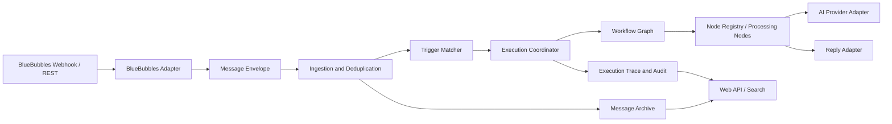

# BubblePilot 概要设计

## 1. 设计目标

BubblePilot 将消息接入、归档、事件匹配、工作流编排、外部服务适配和管理查询拆分为清晰的模块：

```text
BlueBubbles Adapter
        ↓
Message Envelope / Event Store
        ↓
Trigger Matcher
        ↓
Workflow Orchestrator
        ↓
Processing Nodes
        ↓
Message Archive / Reply Adapter / Audit Store
```

首期采用模块化单体和进程内队列。消息通道、执行器和存储都通过接口隔离，未来可以替换为外部队列、独立 Worker 或其他存储，但不改变工作流语义。


## 2. 分层架构



### 2.1 接入层

负责 Webhook 验证、供应商字段解析、来源标识、重复事件识别和调用 BlueBubbles REST。业务模块只能依赖项目定义的适配器接口。

### 2.2 消息层

负责统一消息信封、事件存储、监听范围判定和幂等记录。消息正文和附件元数据采用明确的保存策略，不能由任意节点自行决定是否落库。

### 2.3 编排层

负责触发器匹配、工作流版本选择、执行状态机、超时、重试和并发限制。它不实现具体的关键词判断、AI 调用或消息发送逻辑。

### 2.4 节点层

节点是可注册、可配置、可测试的最小处理单元。节点输入输出通过上下文和事件信封传递；节点可以是条件判断、变量转换、AI 调用、回复、日志或结束节点。

### 2.5 展示与管理层

Web API 提供搜索、配置和执行查询。认证、敏感操作二次验证和审计必须在服务端执行，不能只依赖前端隐藏按钮。

## 3. 核心执行流程

1. BlueBubbles 发送 Webhook。
2. 适配器验证请求并生成 `eventId`、`messageId` 和 `correlationId`。
3. 接入层以 `eventId` 做幂等登记；重复事件直接返回已处理结果。
4. 消息按监听配置决定是否归档。
5. 匹配器查询启用的触发器，生成待执行工作流列表。
6. 编排器锁定工作流版本，创建执行记录。
7. 节点按图执行，产生节点状态和输出摘要。
8. 回复节点通过适配器发送消息，使用幂等键防止重复发送。
9. 执行器记录成功、跳过、失败、重试或死信状态。

## 4. 扩展合同

### 4.1 适配器合同

- `parseInbound(request) -> MessageEnvelope`
- `verifyInbound(request) -> VerificationResult`
- `sendReply(command) -> DeliveryResult`
- `health() -> AdapterHealth`

### 4.2 节点合同

- 稳定的 `type` 和 `version`。
- 配置 Schema 和默认值。
- 输入上下文要求与输出字段声明。
- 超时、重试和可恢复错误策略。
- 不修改其他节点的持久化状态。

### 4.3 Provider 合同

AI Provider 只负责请求格式、鉴权、超时、响应解析和错误归类；提示词拼装、上下文选择和回复策略由 AI 节点或上层工作流负责。

## 5. 单机到集群的演进

### 单机模式

```text
HTTP/Webhook → Application → In-process Queue → Worker Loop → Database
```

### 集群模式（后续）

```text
Webhook Ingress → Durable Queue → Worker Pool → Database / BlueBubbles
```

演进前必须保持以下不变：外部事件幂等键、工作流版本、节点合同、执行状态和回复幂等键。

## 6. 可靠性原则

- 每个外部事件只允许有一个逻辑处理结果。
- 节点失败必须区分可重试、不可重试和人工处理三类。
- 回复发送成功后才将节点标记为成功；网络超时不能直接假设发送失败。
- 执行上下文限制大小，避免把完整历史消息无限传给 AI。
- 所有异步处理都携带 `correlationId`，日志和审计可以串起一次完整执行。
