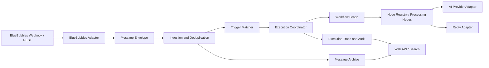

# BubblePilot 概要设计

## 1. 设计目标

BubblePilot 将消息接入、归档、事件匹配、工作流编排、外部服务适配和管理查询拆分为清晰的模块：

```text
BlueBubbles Adapter
        ↓
Message Envelope / Event Store
        ↓
Trigger Matcher
        ↓
Workflow Orchestrator
        ↓
Processing Nodes
        ↓
Message Archive / Reply Adapter / Audit Store
```

首期采用模块化单体和进程内调度。消息通道、执行 Dispatcher、执行器和存储都通过接口隔离，未来可以替换为外部持久队列、独立 Worker 或其他存储，但不改变工作流语义。默认 `InProcessWorkflowExecutionDispatcher` 通过有界执行门限制并发数、等待队列和等待时间，不建立无界 Promise 队列。

入站消息归档后先持久化 `evaluation-pending`。Dispatcher 容量不足或最终判定写入前中断时，供应商重投可从判定阶段恢复；已经完成最终判定的重复事件直接返回历史结果。该边界与工作流执行、节点和出站回复的幂等键共同避免“归档成功但自动化永久丢失”以及恢复时重复发送。


### 1.1 当前技术实现

首个可运行切片采用 Node.js 22+、TypeScript 5、Fastify 5 和 PostgreSQL 16。应用使用 `pg` 与显式 SQL 控制事务和幂等约束，外部输入通过 Zod、OpenAPI 和 JSON Schema 校验；默认以 Docker Compose 部署。

该选择服务于当前 I/O 密集、配置驱动和快速垂直切片的需求，不把语言或框架泄漏到消息信封、节点合同和执行状态语义中。选择理由、Java/Go/Rust 对比、暂缓决策和重评条件见[技术选型](技术选型.md)。

## 2. 分层架构



### 2.1 接入层

负责 Webhook 验证、供应商字段解析、来源标识、重复事件识别和调用 BlueBubbles REST。业务模块只能依赖项目定义的适配器接口。

### 2.2 消息层

负责统一消息信封、事件存储、监听范围判定和幂等记录。消息正文和附件元数据采用明确的保存策略，不能由任意节点自行决定是否落库。

### 2.3 编排层

负责触发器匹配、工作流版本选择、执行状态机、超时、重试和并发限制。它不实现具体的关键词判断、AI 调用或消息发送逻辑。

### 2.4 节点层

节点是可注册、可配置、可测试的最小处理单元。节点输入输出通过上下文和事件信封传递；节点可以是条件判断、变量转换、AI 调用、回复、日志或结束节点。

### 2.5 展示与管理层

Web API 提供搜索、配置和脱敏执行查询。认证、敏感操作二次验证和审计必须在服务端执行，不能只依赖前端隐藏按钮。执行记录列表和详情只需登录，消息正文、审计事件和人工恢复操作仍需二次验证。

## 3. 核心执行流程

1. BlueBubbles 发送 Webhook。
2. 适配器验证请求并生成 `eventId`、`messageId` 和 `correlationId`。
3. 接入层以 `eventId` 做幂等登记；重复事件直接返回已处理结果。
4. 消息按监听配置决定是否归档。
5. 匹配器查询启用的触发器，生成待执行工作流列表。
6. 编排器锁定工作流版本，创建执行记录。
7. 节点按图执行，产生节点状态和输出摘要。
8. 回复节点通过适配器发送消息，使用幂等键防止重复发送。
9. 执行器记录成功、跳过、失败、重试或死信状态。

## 4. 扩展合同

### 4.1 适配器合同

- `parseInbound(request) -> MessageEnvelope`
- `verifyInbound(request) -> VerificationResult`
- `sendReply(command) -> DeliveryResult`
- `health() -> AdapterHealth`

### 4.2 节点合同

- 稳定的 `type` 和 `version`。
- 配置 Schema 和默认值。
- 输入上下文要求与输出字段声明。
- 超时、重试和可恢复错误策略。
- 不修改其他节点的持久化状态。

### 4.3 Provider 合同

AI Provider Adapter 只负责具体接口类型的请求格式、鉴权、单请求超时、响应解析和错误归类；提示词拼装、上下文选择和回复策略由 AI 节点或上层工作流负责。

AI 节点的 `webSearch` 策略为 `disabled`、`auto` 或 `required`，默认关闭。启用时，实例环境变量 `ENABLE_WEB_SEARCH` 仍是总开关。V1.1 优先使用探测成功的 Provider Responses 托管搜索；其他 Provider 必须通过独立的 Function Calling 探测，由进程内 AgentRunner 调用同 Stack 的 SearXNG 并回填结果。工具调用有轮次、次数、超时和输出长度上限，不执行任意脚本；查询与结果正文不持久化。

AI Provider Router 负责锁定路由快照、按固定顺序选择已启用且服务端凭据可用的候选、执行有界 Fallback、汇总失败分类和维护运行时健康状态。它必须把管理员配置的顺序与自动降级产生的有效顺序分开保存，不能因临时故障永久改写配置；管理端的有效候选展示必须复用同一选择语义。

每次 Provider 调用均产生独立尝试记录，至少包含路由版本、Provider、模型、候选序号、节点重试轮次、耗时、结果、稳定错误类别和脱敏错误码。为便于定位空输出、格式异常和供应商偶发错误，Attempt 还保存客户端/供应商请求 ID、HTTP 状态、请求体哈希、消息数量与字符数、响应字节数与响应体哈希、`finish_reason`、可见输出/推理字符数，以及输入、输出、推理、总 Token 和供应商报告的缓存命中/写入/未命中 Token。上述字段只保存大小、计数、哈希和标识，不保存完整 Prompt、聊天正文、AI 输出、Secret 或原始响应体。路由器不能读取或改变消息权限，也不能绕过 AI 输出安全检查。

对可重试的空输出和不符合协议的响应执行有界 Retry/Fallback，并在每个 Attempt 中保留诊断摘要；单 Provider 路由关闭候选切换时仍允许按 `maxRounds` 重试当前 Provider。最终是否命中缓存以供应商返回的 Token 统计为准，不能由请求字符数推断。

## 5. 单机到集群的演进

### 单机模式

```text
HTTP/Webhook → Application → In-process Queue → Worker Loop → Database
```

### 集群模式（后续）

```text
Webhook Ingress → Durable Queue → Worker Pool → Database / BlueBubbles
```

演进前必须保持以下不变：外部事件幂等键、工作流版本、节点合同、执行状态和回复幂等键。

M5 先验证 Dispatcher 接口和 PostgreSQL 恢复事实，不提前引入 Redis、Kafka 或第二个常驻进程。真正启用独立 Worker 前，必须补充持久任务 Claim、租约续期、崩溃回收和多 Worker 竞争测试；仅把 HTTP 进程中的内存队列移到另一进程不视为可靠 Worker 模式。

## 6. 可靠性原则

- 每个外部事件只允许有一个逻辑处理结果。
- 节点失败必须区分可重试、不可重试和人工处理三类。
- 回复发送成功后才将节点标记为成功；网络超时不能直接假设发送失败。
- 执行上下文限制大小，避免把完整历史消息无限传给 AI。
- 所有异步处理都携带 `correlationId`，日志和审计可以串起一次完整执行。
- 管理 API 和 Webhook 分开限流；工作流执行并发、等待数量和等待时间都有显式上限。
- 运行状态摘要至少报告死信、卡住的 Retry、未知出站结果、降级 Provider 和执行队列饱和，且不包含正文、Prompt 或 Secret。
