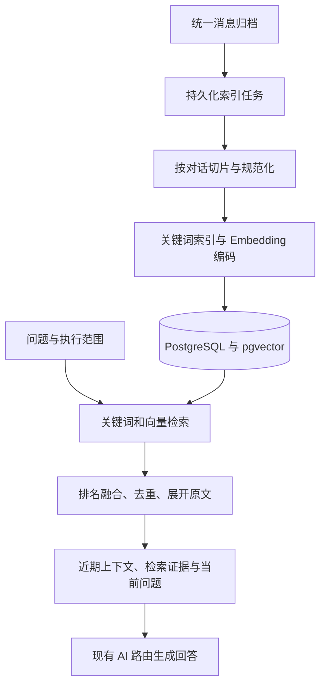

# 迭代需求：长期聊天检索与记忆增强

## 1. 迭代概述

> 状态：开发实现中，尚未完成发布验收。实际运行合同逐步同步至权威文档；真实模型评测待用户部署服务后执行。本文件记录本次讨论形成的方向、建议合同和验收要求，不表示当前版本已经提供相关功能。字段、节点和工具名称均为设计草案；实施时必须同步更新对应权威文档和机器合同。模型建议不表示已经部署或完成性能验证。

### 1.1 背景与问题

聊天 AI 摘要在迁移 0052 中移除，历史事实以原始归档为准，近期上下文使用独立双窗口。

应用已有标准化消息归档、聊天级消息索引、异步任务、AI 路由和执行轨迹，可以在这些基础上增加按需检索。PostgreSQL 中的原始消息继续作为事实来源，检索索引是派生数据。

当前正文默认保留 90 天，具体规则见[技术设计](技术设计.md)。更长时间的检索必须以原文仍在保留期内为前提；本迭代不自动延长保留期，不恢复已经清理或从未归档的聊天内容。

### 1.2 产品目标

用户在当前聊天中询问“以前讨论过什么、谁说过什么、当时为什么这样决定”，Bot 能查找相关历史，阅读上下文，给出带日期和来源的回答。未找到依据、索引不完整或检索不可用时，准确表达范围与限制。

采用三层上下文：

| 层次 | 职责 | 本次范围 |
| --- | --- | --- |
| 双窗口近期原文 | 保持当前对话连贯 | 保留现有机制 |
| 长期聊天检索 | 找回保留期内的相关原文 | 首期核心，融合 AI 对话节点并由 Agent 按需调用 |
| 结构化记忆 | 管理偏好、决定、待办及其有效状态 | 后续独立规划 |

### 1.3 非目标

- 不把历史聊天训练进模型参数，不承诺检索零遗漏或回答零错误；
- 不提供跨聊天、跨实例搜索或全局成员画像；
- 不引入独立知识库产品、微服务、Kafka、图数据库或任意脚本运行时；
- 不导入 BlueBubbles 中尚未归档的历史，不新增本地文件知识库；
- 不新增图片或音频向量模型；仅复用已有可用的图片摘要和规范化文本元数据；
- 首期不承诺“全年所有决定”等穷尽式统计，少量相似片段不能代表完整时间范围；
- 不把模型推断、Bot 回复或片段摘要自动固化为用户事实。

## 2. 用户闭环与需求基线

### 2.1 管理员配置与验证

1. 管理员配置 Embedding 服务地址、模型及必要凭据，测试连接、维度和有限中文样例；
2. 启用全局长期检索能力，选择已监听聊天启用索引；默认关闭，不静默向新模型端点发送已有聊天；
3. 对新增归档异步建立索引。历史补建由管理员明确选择聊天和时间范围后启动，可查看覆盖、失败、暂停和恢复状态；
4. 在受保护的检索测试入口输入问题，检查命中片段、原文与时间；
5. 已授权聊天的长期检索能力自动供现有 AI 对话节点使用，无需添加检索节点、编写调用条件或选择工具；如修改工作流，仍按既有显式授权和审计规则激活；
6. 用户提问后收到有依据的回答，管理员可以从执行详情追溯检索过程。

服务配置、索引启停、补建和重建应完成敏感操作二次验证并写入审计；测试查询涉及正文，同样需要二次验证。具体权限代码与 API 在实施阶段同步定义。

### 2.2 需求列表

| 编号 | 需求 | 目标行为 |
| --- | --- | --- |
| `REQ-MEM-001` | 同聊天长期检索 | 搜索当前授权聊天中、触发消息之前且未清理的归档 |
| `REQ-MEM-002` | 对话片段索引 | 保留时间、发言人、消息关系与原文来源 |
| `REQ-MEM-003` | 混合检索 | 结合语义、关键词、时间和发言人过滤 |
| `REQ-MEM-004` | 来源与上下文 | 命中后展开前后文，回答提供可核对的来源 |
| `REQ-MEM-005` | 增量与补建 | 新消息异步索引，历史任务有界、可暂停恢复 |
| `REQ-MEM-006` | 有限检索执行 | 限制调用次数、候选数量、返回内容和耗时 |
| `REQ-MEM-007` | 生命周期一致 | 清理、停用与模型版本变化不能泄露过期或越权内容 |
| `REQ-MEM-008` | 故障与诊断 | 区分零结果、覆盖不足、语义降级和服务失败 |
| `REQ-MEM-009` | Agent 按需检索 | 首期由 AI 对话节点按问题调用受限只读工具 |

### 2.3 代表性场景

以下均为虚构验收场景：

- 精确查找：“订单 DEMO-2026-0312 当时如何处理？”
- 语义回忆：“之前为什么暂缓购买网络存储设备？”能找到讨论 NAS 的原文；
- 时间与成员：“林晓三月份建议过哪种备份方式？”
- 后续更正：先计划周五上线，后来改期，再后来取消；询问当前状态应检查后续更正；
- 历史解释：询问“当时为什么延期”应保留当时语境，不用后来结论改写过去；
- 无答案或超出覆盖范围：回复“在本次可检索记录中未找到依据”，不能断言从未讨论。

## 3. 技术方案

### 3.1 RAG 流程与模块边界

RAG（检索增强生成）在回答时查找相关材料并提供给模型，不修改模型参数。向量用于查找，原文用于核对和回答。

建议增加 `modules/memory/`，负责切片、索引、范围过滤与检索编排；Embedding 供应商协议封装在适配器内，数据库访问通过仓储接口完成。长期检索融合现有 AI 对话节点，通过 AgentRunner 和工具注册机制接入，不新增独立历史检索节点。Agent 工具与管理员检索测试入口复用同一检索服务和范围校验，分别执行对应入口的认证与授权。

后台执行器保留在应用进程内，通过接口隔离。持久化任务、租约和恢复状态保存在 PostgreSQL，不因进程退出丢失。BlueBubbles 不参与检索决策，业务检索不直接访问供应商 API。

### 3.2 Embedding 与部署建议

首选验证模型为 Ollama `qwen3-embedding:0.6b`，使用完整 1024 维输出。官方模型支持多语言；是否满足中文聊天检索要求，以本项目评测为准。备选 `bge-m3` 仅用于对比，不混合其向量。

已有 M4、16 GB Mac mini 原生 Ollama 的部署场景，可在现有服务中拉取 Embedding 模型，无需额外容器。应用通过受控局域网地址调用，数据库仍部署在应用侧。macOS 原生 Ollama 可使用 Apple Silicon GPU；不要求迁入 Docker。

- Ollama 使用 `/api/embed`，设置禁止静默截断，校验结果条数、维度和有限数值；
- 片段端编码带稳定时间和 `sender_id` 的规范化文本，不加入当前成员昵称；
- 问题端按 Qwen 官方建议附检索任务指令，编码模板与版本随索引配置保存；
- 同一活动索引中的文档与问题必须使用兼容的模型、维度和编码方案；不能按普通聊天路由任意切换不同模型；
- 保存可获得的模型 digest 或制品标识。相同名称或相同维度不能证明模型未变；探测到变化后停止向旧代次混写并要求重建；
- 初始索引并发为 1，使用小批量和有界输入，优先保障现有聊天模型的响应；
- 下载体积不作为运行内存承诺，记录实际峰值内存、交换空间变化和响应延迟。

Embedding 端点仅允许管理员配置，运行时问题不能改变目标地址。沿用凭据加密、日志脱敏和出站地址保护，明确支持经过配置的局域网地址；不能为接入 Ollama 全局放宽其他下载器的 SSRF 防护。Ollama 不直接暴露公网，远程访问使用受控网络或有认证的代理。

本地存储不等于全链路本地推理：使用远程 Embedding 时发送索引文本，使用远程回复 Provider 时发送检索证据。配置页必须说明对应数据流。

### 3.3 对话切片

首期使用确定性规则，结合消息顺序、时间间隔和长度上限组织连续对话，不依赖额外大模型判断话题。

- 每个片段只属于一个聊天，关联精确消息列表及顺序；
- 保存消息索引范围、时间范围、发言人 ID、内容 Hash 和切片版本；
- 按完整消息组织片段，长单条消息按可追溯子片段处理，记录原消息与偏移，不静默截断；
- 可采用小范围重叠；检索后按消息 ID 与范围去重，避免重复占用上下文；
- 尾部未封闭片段通过空闲时间或长度阈值定稿，持续聊天不能永久不索引；
- 尾部变化产生新内容版本，旧任务不能覆盖新版本；
- 已完成的链接预览和图片摘要可以纳入，之后补齐时重建受影响片段；失败或不可用状态不得编造内容；
- 保存用户、Bot 等来源角色，避免将 Bot 推断当成人类已确认陈述；
- 首期直接编码规范化原文，不强制生成额外片段摘要。

目标片段长度建议从数百至一千多中文字符起步，最终参数通过评测确定。切片限制还必须满足模型实际 Token 上限和服务请求字节上限。

### 3.4 混合检索与回答

1. 服务端固定聊天、触发消息独占上界、可访问范围和活动索引代次；
2. 将问题与有限近期上下文用于查询构造，解析显式时间和成员条件。日期继承当前执行时区；成员名称歧义时不任意绑定；
3. 并行执行关键词与向量召回。中文关键词方案建议应用侧分词后写入 PostgreSQL `tsvector`，使用 GIN 索引；精确标识保留完整 Token，必要时使用受限子串匹配；
4. 使用 RRF 排名融合，不直接相加不可比较的原始分数；
5. 合并重叠结果、展开前后原文，并在读取时重新检查内容有效性和范围；
6. 对当前状态类问题，在预算内检查后续更正；找不到完整变化链时说明无法确认最新状态；
7. 将有限证据附在动态上下文区域，保留既有稳定 Prompt 前缀；
8. 回答延续角色语气，内部来源标记经校验后移除；无证据不强行生成历史事实。

首期不引入专用 Reranker。评测证明排名不足后，再独立评估其资源成本和收益。小规模先测精确向量检索；数据量和延迟需要时增加 HNSW，并对有聊天与时间过滤的查询验证召回不足、过度扫描和有界回退。

候选为两路各最多 40 个，融合后默认 8 个片段、limit 上限 20。历史工具与联网工具共用 Agent 运行预算，默认 10 次调用、24,000 字符序列化结果、60 秒累计工具耗时；原文展开和后续更正不再单独限次。这些是资源上限，不是性能承诺。超限返回明确的裁剪或不完整状态，不静默截断关键结论。

## 4. 数据库、索引与一致性

### 4.1 数据模型草案

| 实体 | 关键数据 | 约束 |
| --- | --- | --- |
| 原始 `Message` | 现有正文、角色、成员、时间与消息索引 | 继续作为事实来源 |
| `ChatMemoryChunk` | 聊天、消息范围、检索文本、内容版本、Hash、有效状态 | 同一片段只发布完整有效版本 |
| `ChatMemoryChunkMessage` | 片段、消息 ID、顺序、可选文本偏移 | 支持展开来源和清理反向定位 |
| `ChatMemoryEmbedding` | 片段版本、索引代次、模型标识、向量 | 不同向量空间隔离 |
| `ChatMemoryIndexGeneration` | 模型、维度、切片和编码版本、构建与活动状态 | 活动代次原子切换 |
| `ChatMemoryIndexJob` | 范围、版本、原因、状态、租约、重试 | 幂等任务，重启可恢复 |
| `ChatMemoryRetrievalTrace` | 执行、范围、代次、来源 ID、耗时、状态、裁剪原因 | 不持久化查询正文或证据正文到普通轨迹 |

关键词索引使用 PostgreSQL 原生能力；向量列使用 pgvector。首期 1024 维可采用 `vector(1024)`。后续模型若改变维度，应使用独立表或分区及对应索引，不能仅改变配置后写入原列。

不在规划阶段新增实际 SQL 迁移。实施时采用追加式迁移，并选择与 PostgreSQL 16 兼容、固定版本的 pgvector 部署制品。检索关闭且未安装扩展的现有部署应能正常升级和运行，扩展安装与可选索引结构初始化必须有独立的能力检测及启用流程，不能让普通启动迁移无条件依赖尚未安装的扩展。

### 4.2 索引任务与历史补建

- 归档事务写入持久化索引意图或等价可恢复记录，后台调用失败不阻断消息归档和工作流调度；
- 使用数据库领取、租约、续租、有限重试、退避和死信状态；幂等键至少覆盖片段内容版本与索引代次；
- 发布前复查源消息仍有效、配置代次仍允许写入，过期任务标记 `superseded`；
- 历史补建固定聊天、时间范围和起始上界，按批推进，可暂停、恢复和取消；新增消息走增量任务；
- 启动只恢复未完成任务，不自动从第一条消息全量重建；
- 展示有效消息覆盖数量、时间范围、待处理数和失败缺口，不能用“最大已处理索引”冒充无缺口覆盖。

模型、维度、切片或编码方案变化产生新索引代次。新代次构建与验证期间继续使用兼容的旧代次；查询必须使用旧代次对应模型。模型已不可用时明确降级，不能用新模型的问题向量查询旧索引。新代次覆盖达到管理员选择范围并通过检查后原子切换，旧代次按清理策略回收。

### 4.3 事件范围与清理

- 查询和展开均不得读取索引大于或等于触发消息的原文；跨越上界的片段不能整体作为候选证据，可从上界内原文走有界关键词补充；
- 片段向量、派生文本若包含上界之后的消息，同样不能用于较早事件的语义召回；
- 同一执行记录实际使用的代次与证据版本，后续工具轮次沿用该代次；源内容已清理时拒绝重放旧正文，注明不可恢复；
- 只允许当前已监听且启用检索的聊天进入 Bot 检索。聊天停用或软删除后立即拒绝新检索，按现有保留策略管理归档；重新启用先核对索引有效性；
- 正文清理事务同步失效所有受影响片段、关键词内容、向量和缓存可见性，防止清理后继续被检索；物理删除可分批执行，但读取不得依赖它完成；
- 清理与索引发布、检索读取竞态必须受版本检查保护。发送给 Provider 前再次验证来源有效性；已发送的请求无法撤回，但不得继续追加或重试发送已失效正文；
- 旧代次、失败任务、证据缓存也受同一清理规则约束，索引不是绕过保留期的副本。

## 5. 工作流、工具与权限合同

### 5.1 AI 对话节点融合

长期检索是现有 AI 对话节点的内置只读工具能力，不新增 `search-chat-history` 工作流节点。管理员负责配置服务、启用能力和授权聊天范围；用户无需判断检索时机、单独选择工具或在工作流编写检索条件。

工作流保持“加载近期上下文 → AI 对话 → 回复”。AI 对话节点在全局能力与当前聊天授权均开启时，自动获得历史搜索和原文展开工具。模型根据当前问题与近期上下文决定是否调用、如何构造查询、是否展开前后文，随后在同一次 AI 对话执行中生成回答。

- 普通问候、文本润色或近期上下文足以回答的问题，不要求调用历史检索；
- 需要依据较早聊天事实回答时，通过工具查找，不能凭模型自身印象编造历史；
- 面向后续润色、审核等节点，沿用 `includeLoadedContext` 的上下文隔离意图：关闭时不自动提供聊天检索工具，避免下游节点重新获取聊天资料；具体能力条件需同步 AI 节点合同；
- 不支持工具调用的 Provider 不伪装成支持长期检索。路由在需要提供该能力时选择已验证工具能力的候选；无可用候选时明确记录能力不可用，并按现有路由规则处理；
- 聊天 ID、事件上界、活动索引代次和授权范围由运行时固定，模型只能在该范围内提交查询条件；
- 模型决定是否检索，服务端决定是否允许检索及最多检索多少，不能把模型判断作为权限边界。

是否应调用工具属于首期质量验收：既验证历史问题的工具调用与证据使用，也验证无需检索时不会无意义调用。不能承诺模型每次都能正确判断，需通过工具描述、提示和回归评测持续约束。

### 5.2 首期 Agent 工具与结果合同

首期提供 `search_chat_history` 和 `read_chat_excerpt`，均通过稳定工具合同注册，复用同一检索服务。搜索输入为问题文本、可选时间和发言人条件；展开只接受本轮已授权来源引用。工具不修改归档、记忆配置或工作流，也不直接发送消息。

默认单次 AI 对话执行与联网工具共用 10 次调用额度，整体耗时与证据预算不随 Agent 轮次或 Provider Fallback 重置放大。Agent 不得通过反复改变过滤条件绕过上限。只读工具失败不能触发重复出站回复。

搜索结果至少包含：

- `status`：`succeeded`、`no-results`、`partial`、`unavailable`；
- `retrievalMode`：`hybrid` 或 `keyword-only`；
- `evidence`：来源引用、时间、`sender_id`、角色和有限原文；
- `coverage`：有效覆盖范围、缺口与待索引信息；
- `indexGenerationId`、裁剪标记及诊断引用。

这些是待实施的建议枚举。索引覆盖不足与零命中是独立信息，必须同时表达。工具结果以可追溯的证据返回 AI，不作为系统指令执行；后续轮次复用已读取且仍有效的证据，避免重复查询。

Embedding 不可用时，可在同一授权范围和预算内降级为关键词检索；检索整体不可用或预算耗尽时返回明确状态，让 AI 告知无法核对历史，不伪装成零结果，也不生成无依据的历史结论。零结果本身不是服务错误。无需历史依据的问题仍可正常回答。

### 5.3 内容、身份与引用

- 管理员接口沿用会话或 Bearer 认证，正文和成员资料继续要求服务端二次验证；
- Bot 运行时依据已授权工作流、聊天监听与检索配置读取，不复用管理员临时二次验证会话；
- 扩展现有成员合同，仅加载当前消息、近期窗口和本次实际返回证据中出现的成员映射，保持聊天隔离；
- 证据中的用户指令、链接和 Bot 文本均为不可信数据，不能改变权限、系统提示或工具范围；
- 模型使用短来源标记，由服务端校验其确实属于本次证据；面向聊天移除引用标记，不自动追加日期与发言人标签，详细来源在执行详情查看，不发送内部数据库 ID 或管理凭据；
- 管理端可通过受保护的来源跳转查看原文，聊天内不要求存在 BlueBubbles 永久消息链接；
- 不把内部索引状态直接拼到面向用户的回答，只用自然语言说明可检索范围或暂时不可用。

## 6. 管理界面与可观测性

全局 AI 设置增加长期检索配置与连接测试；聊天设置提供索引启用、覆盖状态和历史补建入口。“执行与审计”增加独立后台索引任务视图，工作流详情只展示本次检索引用与诊断。

界面必须覆盖保存中、失败、过期响应丢弃、暂停中、完成和页面离开后的任务恢复。关闭敏感内容视图或二次验证过期后，立即收起测试问题、命中正文和成员映射。操作失败保留可安全重试的状态，不能通过前端按钮禁用代替服务端幂等。

普通轨迹记录：聊天与执行 ID、模型和代次、过滤范围、候选数、返回数、来源 ID、耗时、状态、降级和裁剪原因。查询文本本身可能包含敏感信息，不沿用联网搜索日志的正文记录方式；完整 Prompt、向量数组、原文、凭据和原始模型响应均不进入普通日志。

监控至少覆盖积压任务、最老等待时间、失败率、覆盖缺口、检索 p50/p95、关键词降级率和索引存储量。性能诊断与敏感内容查看分开。

## 7. 分阶段实施与交付

| 阶段 | 交付 | 完成门槛 |
| --- | --- | --- |
| P0：基准与合同确认 | 虚构中文评测集、Ollama 探测、切片和分词实验、数据库扩展部署方案 | 确认输出维度、资源预算、检索质量及中文关键词方案 |
| P1：可追溯检索闭环 | 数据模型、增量与补建、混合检索、受保护测试页、AI 对话内置工具、来源回答与清理 | 本文首期功能、安全、恢复和质量验收通过 |
| P2：检索质量与性能优化 | 基于评测优化切片、调用策略、排序和索引，按需评估 Reranker | 相对首期基线证明质量收益与资源成本 |
| P3：结构化记忆 | 偏好、决定、待办及来源、有效时间、更正与人工纠正 | 另行制定需求，不纳入本次承诺 |

首期按 P0 → P1 交付，不以“向量写入成功”作为产品完成。P1 必须能从用户问题走到可核对回答，且由 AI 自主完成按需工具调用，具备清理和故障处理。

## 8. 验收与回归计划

### 8.1 功能和边界

| 验收项 | 通过条件 |
| --- | --- |
| 同义表达 | 不含原关键词的问题能找到标注的中文原文 |
| 精确标识 | 虚构订单号、项目名保留精确召回能力 |
| 时间和成员 | 时间过滤正确处理时区，成员条件不跨聊天解析 |
| 对话完整性 | “可以”“改到下周”等短回复能展开必要上下文 |
| 更正与角色 | 当前状态检查后续更正，Bot 推断不当作用户确认 |
| AI 自主检索 | 无独立检索节点或手写条件，AI 对话能调用搜索、按需展开并使用来源回答 |
| 调用时机与预算 | 历史问题按需查证，普通问候不强制检索，多轮与 Fallback 不重置总预算 |
| 能力与上下文隔离 | 不支持工具的 Provider 明确处理能力不可用，关闭上下文的下游节点不自动获得检索工具 |
| 来源 | 日期和来源来自实际返回证据，模型杜撰引用被拒绝 |
| 无答案 | 无依据、超保留期和覆盖不足不伪造确定结论 |
| 事件边界 | 排队期间新消息及其派生片段不进入较早执行 |
| 越权 | 跨聊天 ID、伪造引用、越界展开均被服务端拒绝 |
| 清理竞态 | 清理后向量、关键词、旧代次和缓存都不能返回源内容 |
| 提示注入 | 历史中的恶意指令不扩大权限或改变工具范围 |
| 异步恢复 | 重启、租约过期、重复归档不会重复发布或漏掉索引意图 |
| 模型更换 | 同名模型变更、维度不符、混代查询均被检测和隔离 |
| 服务失败 | Ollama 超时可按策略降级，零结果不误报宕机 |
| 业务兼容 | 功能关闭时既有双窗口、归档、工作流和回复幂等保持有效 |

### 8.2 质量与性能基准

建立至少 40 个虚构问题，覆盖精确匹配、语义回忆、跨片段解释、日期、发言人、更正、无答案与歧义，每题标注预期来源和允许结论。单独保留至少 10 个未用于调参的问题。

P0 建议以有答案问题的来源 Recall@5 不低于 85% 为初始发布目标；无答案用例不得编造事实或引用。该阈值需在 P0 结束时确认并冻结，不能在看到最终结果后下调。自动验证引用和范围，人工复核事实支持性，不能只用另一个模型打分。

对比“仅近期原文”“关键词检索”“向量检索”“混合检索”，记录召回、支持性和延迟。使用虚构数据在 1 万和 10 万条消息规模测试，报告聊天分布与实际片段数；冷启动、热查询、历史补建与聊天回复并行分别测量。

热查询建议以检索 p95 不超过 3 秒为初始目标，不含最终回复模型生成；单次 Agent 工具累计预算默认 60 秒，不代表单条热查询应等待到该上限。记录 Mac mini 上实际内存、交换空间变化、索引吞吐和回复延迟增量。未达到目标时先降低批量、并发并优化索引，不直接承诺更换大模型可解决。

### 8.3 工程回归

按[开发与发布](开发与发布.md)执行 `pnpm verify`、`pnpm security:check`、`docker compose config`，并在配备 pgvector 的 PostgreSQL 16 测试环境执行真实数据库集成测试。

新增测试覆盖向量协议、中文检索、过滤后的近似索引召回、租约与发布事务、代次切换、正文清理竞态、认证、引用越权和工具预算。部署验证覆盖无扩展且功能关闭、启用扩展、升级、备份恢复与故障回退。Web 异步交互证据归入[验收与演练](验收与演练.md)。

## 9. 迁移、发布与文档同步

- 本次规划不修改生产 Schema、环境变量、认证实现或工作流合同；
- 实施采用追加式迁移，先完成扩展和结构准备，再显式启用，不能自动全量补建；
- 配置保存与历史重建分开，新模型不能静默覆盖原索引；
- 回退可先关闭检索以恢复原有回复路径；数据库降级前必须确认向量类型、扩展和备份兼容，不通过直接移除扩展回滚；
- 备份包含敏感派生文本和向量，遵循原归档保护规则；重建索引需要保留原文、模型版本和切片配置；
- 不自动将消息保留期改成无限。管理员延长保留期只影响仍存在及后续内容，不能恢复已清理记录。

实现阶段同步更新：

| 权威来源 | 应更新内容 |
| --- | --- |
| [产品与范围](产品与范围.md) | 新需求编号、用户闭环、非目标 |
| [技术设计](技术设计.md) | 模块、pgvector、任务、生命周期与权限 |
| [事件与工作流设计](事件与工作流设计.md) | AI 对话工具能力、证据区、身份范围和失败策略 |
| [接口与配置契约](接口与配置契约.md) | 实际 API、权限、配置和错误码 |
| [部署与运维](部署与运维.md) | 扩展部署、Ollama、受控网络、备份与重建 |
| [验收与演练](验收与演练.md) | 异步 UI、可靠性与质量证据 |
| [机器合同目录](../contracts/) | 实际 OpenAPI 与工作流 Schema |

本文件保留需求追溯；落地后的运行合同由上述文档维护，不长期复制相同字段和配置说明。

## 10. 方向与待验证项

本次讨论已明确的方向：保留双窗口原文和长期原文检索；采用 PostgreSQL 与 pgvector；复用现有 Ollama 部署能力；首期只处理同聊天，检索融合 AI 对话节点，由 AI 自主调用只读工具，不要求用户配置独立检索节点；先验证小型中文 Embedding 模型，再考虑更大模型和结构化记忆。

本文提出、需在 P0 验证并冻结的实施选择：`qwen3-embedding:0.6b` 与 1024 维、中文分词库、切片参数、候选与证据预算、AI 对话能力及工具合同、延迟与召回门槛。管理员侧入口和启用粒度按本文建议实施前完成交互审查，不视为用户已逐项确认的产品决策。

参考资料（模型规格核对日期：2026-09-10）：

- [Ollama Qwen3 Embedding 0.6B](https://ollama.com/library/qwen3-embedding:0.6b)
- [Qwen 官方模型说明](https://huggingface.co/Qwen/Qwen3-Embedding-0.6B)
- [Ollama BGE-M3](https://ollama.com/library/bge-m3)
- [pgvector 项目说明](https://github.com/pgvector/pgvector)

## 11. 开发阶段确认的补充决策

- 默认数据库镜像内置 pgvector，采用 PostgreSQL 16，旧 Alpine 数据库通过验证过的逻辑备份恢复切换，不假设可直接复用卷。
- 首期同时支持 Ollama 与 OpenAI 兼容 Embedding API，维度随索引代次验证，首期使用精确向量搜索。
- Agent 自主搜索与展开纳入首期，不提供独立工作流检索节点。
- 中文分词采用 Node.js `Intl.Segmenter`，补充完整字母数字标识；目标 800、上限 1600 字符，30 分钟分段。
- 用户明确暂缓真实模型评测，待其部署完成后继续；发布门槛不因暂缓而视为通过。工程与验收状态以[验收与演练](验收与演练.md)为准。

### 近期发言与上下文覆盖

历史归档工具已扩展为 5 个：原文查询、语义搜索、来源展开、精确计数、首末消息。工具合同见[接口与配置契约](接口与配置契约.md#聊天归档工具合同)。新运行仅注册新名称；旧执行中的 get_latest_chat_messages 名称及原有来源仍可查看。

最后发言与时间段查询使用上述工具，主题查询仍使用相关度搜索；相关度排序不能证明最近一次。身份不明时不能猜发言人，相对日期依据当前消息时间及聊天时区解释。本轮不修改摘要生成或增加回答事实审核。

执行上下文新增可选 `historyCoverage`：`windowEvicted`、`retained`、`omitted`；三项为 null 或包含 `count`、`firstMessageIndex`、`lastMessageIndex`、`earliestSentAt`、`latestSentAt` 的范围。条数来自实际候选消息，时间为发送时间极值，不用索引差推算。`contextIncompleteReasons` 包含 `window-evicted`、`history-trimmed` 或 `character-overflow`；任一原因使 `contextIncomplete=true`。该信息进入模型输入及执行快照，不含遗漏正文；旧执行不回填，显示“未记录覆盖范围”。范围分别描述消息窗口移出和加载候选的字符裁剪，不代表被授权过滤或已清理内容的覆盖情况。

### Bot 作者身份兼容

归档作者是消息归属的权威来源，检索片段与来源哈希包含作者信息。原文及引用返回 Bot 工作流身份和发送时昵称或首次昵称历史映射；语义检索支持 botWorkflowId，不能将昵称作为 senderId。不同 Bot 不会因共用网关账号在成员分组中合并。

旧格式及身份过期片段不参与召回、不计已索引覆盖；身份补齐后由管理员手动重建，沿用聊天授权和索引代际。原文查询与完整 SQL 统计继续可用。迟到索引写入必须通过聊天身份版本、任务租约和消息作者哈希复核；未知来源不冒充当前 Bot。
